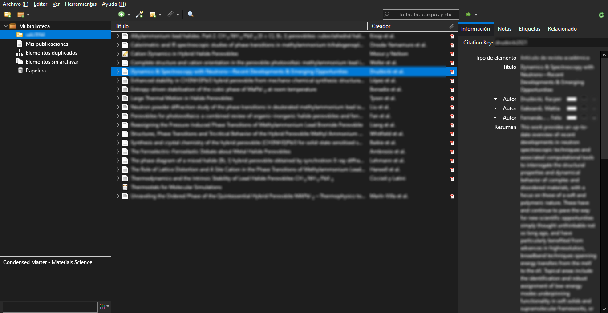
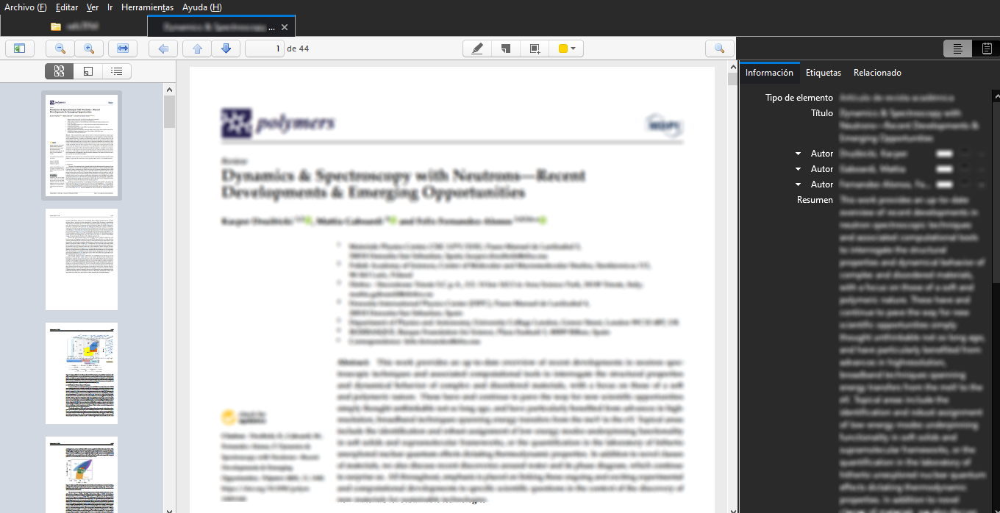

# Zotero Shadow
A dark theme for the Zotero reference manager, with the exception of the PDF viewer, for easier reading. This is a continuation of the Zotero Dark Theme by [Dominic-DallOsto](https://github.com/Dominic-DallOsto/Zotero-Dark-Theme) and [Rosmaninho](https://github.com/Rosmaninho/Zotero-Dark-Theme).  

Zotero Shadow is intended for Windows. It may run on Linux, although it is not supported and may display minor glitches. For Linux, it is recommended to use the Zotero Flatpak version, which already includes a dark mode.  

## Installation
Copy the `chrome` folder into your Zotero profile directory
* On Windows  
`C:\Users\<User>\AppData\Roaming\Zotero\Zotero\Profiles\<XXXXXXXX.default>\`
* On Linux  
`~/.zotero/zotero/<XXXXXXXX.default>/`

